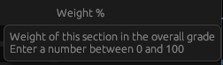

This is a rust and egui based version of my [GradeWeightCalculator](https://github.com/Devon-Scott/GradeWeightCalculator)

I decided to remake the project in Rust for several reasons:
- Building a self-contained executable using Qt proved to be too much of a headache due to complications with dynamic linking, or building a static version of Qt. From my research, it seemed to me like it would be easier to build such an executable using Rust
- I wasn't happy with the layout of the Qt-based project, and I knew it could be rearranged to be organized better
- The parser I previously made wasn't very robust. It could handle basic syntax and do the job, but I wanted to explore how to properly parse mathematical expressions and turn them into usable values. 
- I also liked seeing how easy it is to add test cases to Rust files

## Installation

### Windows
Download the latest `.exe` from the [Releases page](https://github.com/Devon-Scott/grade_calculator/releases)

### Build from source
```bash
cargo install --git https://github.com/Devon-Scott/grade_calculator
```

## Usage

- In the "Marks / Total" section, you can input a mathematical expression that represents your earned scores out of the total marks available, and you can mouse over the header to see an example format:

<p align="center">
  
</p>


- In the "Weights" section, enter a value that represents the total weight for that section of the course. For example, if the assignments were worth 30% of the grade, simply input 30

<p align="center">
  
</p>